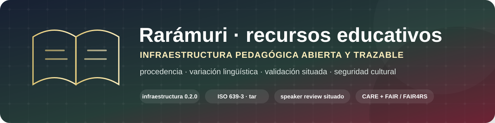

<p align="center">
  
</p>

<p align="center">
  <strong>Infraestructura pedagógica complementaria a Rarámuri Digital para desarrollar recursos educativos con procedencia, variación lingüística, validación situada y seguridad cultural explícitas.</strong>
</p>

<p align="center">
  <a href="https://github.com/fersandovalgtz/raramuri-recursos-educativos/actions/workflows/validate-repository.yml"></a>
  <a href="CITATION.cff"></a>
  <a href="codemeta.json"></a>
  <a href="FAIR_ASSESSMENT.md"></a>
  <a href="SCIENTIFIC_REPOSITORY_STANDARD.md"></a>
</p>

<p align="center">
  <a href="https://orcid.org/0000-0002-3168-6725"></a>
  <a href="https://www.uacj.mx/"></a>
  
  
  
</p>

<p align="center">
  <a href="VALIDATION_STATUS.md"></a>
  
  
  
  
</p>

<p align="center">
  <a href="#propósito"><strong>Propósito</strong></a> ·
  <a href="#estados-de-validación"><strong>Validación</strong></a> ·
  <a href="PROVENANCE.md">Procedencia</a> ·
  <a href="GOVERNANCE.md">Gobernanza</a> ·
  <a href="FAIR_ASSESSMENT.md">FAIR</a> ·
  <a href="CULTURAL_SAFETY.md">Seguridad cultural</a> ·
  <a href="README.en.md">English</a>
</p>

## Propósito

**Rarámuri · recursos educativos** separa de manera deliberada la infraestructura lexicográfica de la infraestructura pedagógica:

- **[Rarámuri Digital](https://github.com/fersandovalgtz/raramuri-digital)** conserva datos lexicográficos, API, formatos interoperables, metadatos científicos, procedencia y preservación.
- **Este repositorio** desarrolla actividades, cuadernos, secuencias, vocabularios de aprendizaje, recursos visuales y, cuando existan permisos adecuados, audio y pronunciación.

La separación evita presentar una entrada lexicográfica técnicamente disponible como si ya fuera una decisión didáctica, lingüística o culturalmente validada.

## Principios de integridad

1. La disponibilidad técnica no equivale a autoridad lingüística.
2. Toda palabra, ejemplo, audio o contenido cultural debe conservar procedencia.
3. Las variantes lingüísticas no se presentan como errores por no coincidir con una única forma.
4. Los materiales no sustituyen conocimiento comunitario, familiar, escolar ni de personas hablantes.
5. Los contenidos sensibles no se publican por defecto.
6. La gamificación y la tecnología son medios pedagógicos, no argumentos suficientes para simplificar o folclorizar la lengua.
7. La revisión técnica, lingüística y comunitaria son estados diferentes y deben documentarse por separado.

## Estados de validación

```text
draft
  ↓
source-checked
  ↓
technical-reviewed
  ↓
speaker-reviewed        ← sólo cuando ocurrió
  ↓
community-reviewed      ← sólo cuando ocurrió
  ↓
published
```

Un recurso revisado por una persona hablante no se presenta automáticamente como válido para todas las variantes. La revisión debe conservar alcance, contexto y procedencia. Véanse [`VALIDATION_STATUS.md`](VALIDATION_STATUS.md), [`REVIEW_WORKFLOW.md`](REVIEW_WORKFLOW.md) y [`PROVENANCE.md`](PROVENANCE.md).

## Antecedentes académicos verificables

La línea pedagógica tiene antecedentes públicos en *Rarámuri nivel inicial: Cuaderno para el docente* (UACJ, 2021) y en **Mapu tamu rarámuri arí’ichabo / ra’íchabo**, proyecto desarrollado entre 2020 y 2022 sobre recursos digitales, práctica docente, mediación tecnológica y pertinencia intercultural.

<p>
  <a href="https://www.uacj.mx/internacionalizacion/boletin/UACJinternacional/2021/libro-raramuri.html"></a>
  <a href="https://cathi.uacj.mx/handle/20.500.11961/31228"></a>
  <a href="https://doi.org/10.5281/zenodo.21483353"></a>
</p>

Rarámuri Digital constituye desde 2026 la fuente lexicográfica estructurada y citable que este repositorio puede utilizar, sin confundir la capa de datos con la capa pedagógica.

## FAIR, FAIR4RS y CARE

La infraestructura adopta prácticas de descubribilidad, acceso, interoperabilidad y reutilización, pero no considera FAIR suficiente para resolver autoridad, consentimiento o pertinencia cultural. [`FAIR_ASSESSMENT.md`](FAIR_ASSESSMENT.md) documenta fortalezas y brechas sin afirmar certificación externa. [`GOVERNANCE.md`](GOVERNANCE.md) y [`CULTURAL_SAFETY.md`](CULTURAL_SAFETY.md) mantienen explícitos los límites éticos y comunitarios.

## Documentación principal

| Dimensión | Documento |
|---|---|
| Marco pedagógico | [`PEDAGOGICAL_FRAMEWORK.md`](PEDAGOGICAL_FRAMEWORK.md) |
| Procedencia | [`PROVENANCE.md`](PROVENANCE.md) |
| Gobernanza | [`GOVERNANCE.md`](GOVERNANCE.md) |
| Estado FAIR/FAIR4RS | [`FAIR_ASSESSMENT.md`](FAIR_ASSESSMENT.md) |
| Estándar científico | [`SCIENTIFIC_REPOSITORY_STANDARD.md`](SCIENTIFIC_REPOSITORY_STANDARD.md) |
| Historia de proyectos | [`PROJECT_HISTORY.md`](PROJECT_HISTORY.md) |
| Relación con fuentes | [`SOURCE_RELATIONSHIP.md`](SOURCE_RELATIONSHIP.md) |
| Variación lingüística | [`VARIATION_POLICY.md`](VARIATION_POLICY.md) |
| Modelo de contenidos | [`CONTENT_MODEL.md`](CONTENT_MODEL.md) |
| Seguridad cultural | [`CULTURAL_SAFETY.md`](CULTURAL_SAFETY.md) |
| Audio y consentimiento | [`AUDIO_POLICY.md`](AUDIO_POLICY.md) |
| Flujo de revisión | [`REVIEW_WORKFLOW.md`](REVIEW_WORKFLOW.md) |
| Licencias | [`LICENSE_STRATEGY.md`](LICENSE_STRATEGY.md) |
| Seguridad | [`SECURITY.md`](SECURITY.md) |

## Estado

**Versión de infraestructura 0.2.0 · agosto de 2026.** La fase actual publica marcos, inventarios y flujos de validación. No se afirma que el contenido lingüístico esté validado de forma exhaustiva u homogénea para todas las variantes territoriales.

## Ecosistema relacionado

[Rarámuri Digital](https://github.com/fersandovalgtz/raramuri-digital) · [Rarámuri Histórico](https://github.com/fersandovalgtz/raramuri-historico) · [Cahíta Histórico Digital](https://github.com/fersandovalgtz/cahita-historico-digital) · [Perfil científico](https://github.com/fersandovalgtz)

## Responsable

**Fernando Sandoval Gutierrez**  
ORCID: [0000-0002-3168-6725](https://orcid.org/0000-0002-3168-6725)
